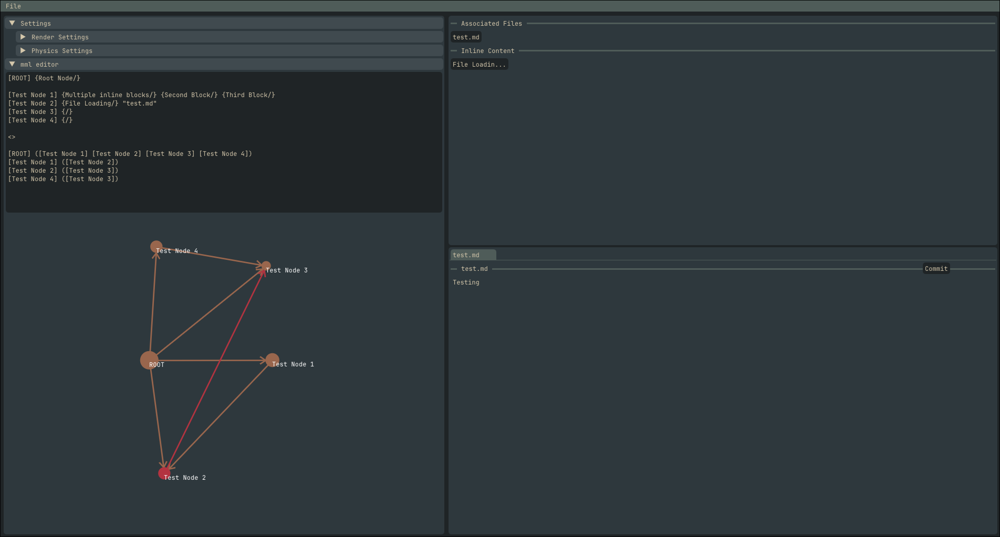

# Info 
A simple app that tries to replicate obsidian's graph view (With a twist). The app uses a notation called mml (Mind map language) which I created to construct and display the graph. 


## MML notation 
You start by defining the nodes, their content and associated files first. Name of node must be enclosed by square brackets `[]` while the content must be enclosed with `{ /}`. A path for associated file must be enclosed by `" "` and should be outside of content blocks. Path is relative to .mml file. Example 

```
[Root Node] "associated_file.md" {Possible to have multiple files and content blocks/}
```
Once this is done you put `<>` to specify that connection phase has begun. This phase follows the given notation  
```
[Parent node] ([Child node 1] [Child node 2] [Child node 3])
```

## How to build the project 
Dependencies: 
1. L4's cimgui bindings with glfw and OpenGL backends
2. Bindings for [Native file dialogue](https://github.com/Paynzin/nativefiledialog-odin) extended

Once dependencies are resolved simply run `odin build .` to build the project.

